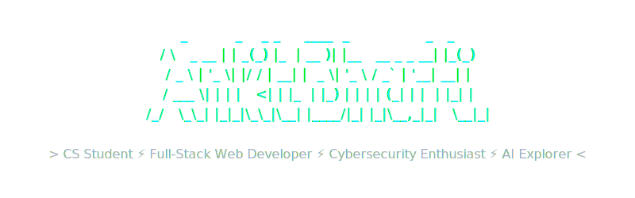

    
  

  ---

  ### 💻 <code>whoami</code>

  

    <!-- Multi-line typing animation that looks like a terminal executing -->
    <a href="https://git.io/typing-svg">
      _+%F0%9F%8E%93+Computer+Science+student+driven+by+curiosity.;>_+%F0%9F%8C%90+Solid+foundations+in+Full-Stack+Web+Dev.;>_+%F0%9F%9B%A1%EF%B8%8F+Diving+deep+into+Cybersec+%26+Penetration+Testing.;>_+%F0%9F%A4%96+Exploring+Artificial+Intelligence+Integrations.;>_+%F0%9F%8E%AF+Goal%3A+Engineer+smart%2C+scalable%2C+secure+systems." alt="Terminal Output" />
    </a>
  

  ---

  ### 🛠️ <code>skills --list</code>

  

    <!-- Core Web -->
    
    
    
    
    
     
    <!-- Security & AI & Tools -->
    
    
    
    
    
  

  ---

  ### 📡 <code>github --stats</code>

  

    
    
  

   

  

    
  

  ---

  ### 🌐 <code>ping -c 3 connections</code>

  Got a project idea, a hackathon invitation, or just want to chat about tech?
  

    
    
    
  

   
  
<code>"Code like a developer, think like a hacker."</code>

